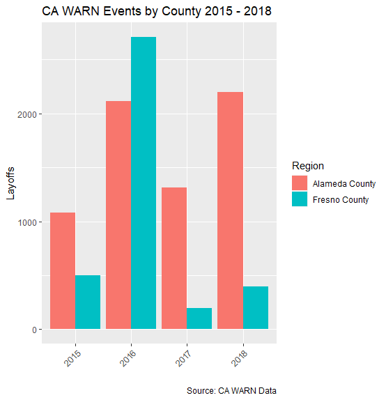

# Introduction to jobsec

## California WARN Database

Job layoffs can be incredibly disruptive to communities. Layoffs typically involve large-scale workforce reductions in a concentrated area, which can generate ripples throughout the broader local economy. Thus, state Departments of Labor and local business bureaus benefit from the ability to cleanly observe and forecast layoffs as they occur. By law, all firms in the United States with 50 or more employees are required to provide 60 days' advance notification to employees and the state labor departments before a layoff occurs to be compliant with the Worker Adjustment and Retraining Notification Act (WARN).

The jobsec package is a dashboard for policymakers to anticipate and respond to layoffs in California as they occur. In particular, the jobsec package:
  - Downloads and cleans the most recently available job layoff data from the California Employment and Development Department (EDD)
  - Easily browse and summarize historical layoff data
  - Project future layoffs
  
This document introduces users to jobsec's basic tools, including the various data sources underlying the package.

## WARN Reports

The primary purpose of jobsec is to scrape the California EDD website to download and process up-to-date current-year WARN data. Users can download WARN reports tables for any fiscal year (or combination of fiscal year) using the function `jobsec::warnDownload`. The dataset `warnSample` provides archived data for fiscal years 2014-2018. A sample of the WARN data format is provided below:

<table>
 <thead>
  <tr>
   <th style="text-align:left;"> notice_date </th>
   <th style="text-align:left;"> effective_date </th>
   <th style="text-align:left;"> received_date </th>
   <th style="text-align:left;"> company </th>
   <th style="text-align:left;"> city </th>
   <th style="text-align:left;"> county </th>
   <th style="text-align:right;"> n_employees </th>
   <th style="text-align:left;"> layoff_reason </th>
  </tr>
 </thead>
<tbody>
  <tr>
   <td style="text-align:left;"> 2018-06-29 </td>
   <td style="text-align:left;"> 2018-08-28 </td>
   <td style="text-align:left;"> 2018-07-02 </td>
   <td style="text-align:left;"> Dream Center Education Holdings, LLC </td>
   <td style="text-align:left;"> Alameda </td>
   <td style="text-align:left;"> Alameda County </td>
   <td style="text-align:right;"> 78 </td>
   <td style="text-align:left;"> Closure Permanent </td>
  </tr>
  <tr>
   <td style="text-align:left;"> 2018-06-29 </td>
   <td style="text-align:left;"> 2018-08-28 </td>
   <td style="text-align:left;"> 2018-07-02 </td>
   <td style="text-align:left;"> Dream Center Education Holdings, LLC </td>
   <td style="text-align:left;"> Ontario </td>
   <td style="text-align:left;"> San Bernardino County </td>
   <td style="text-align:right;"> 88 </td>
   <td style="text-align:left;"> Closure Permanent </td>
  </tr>
  <tr>
   <td style="text-align:left;"> 2018-06-29 </td>
   <td style="text-align:left;"> 2018-08-28 </td>
   <td style="text-align:left;"> 2018-07-02 </td>
   <td style="text-align:left;"> Dream Center Education Holdings, LLC </td>
   <td style="text-align:left;"> Sacramento </td>
   <td style="text-align:left;"> Sacramento County </td>
   <td style="text-align:right;"> 124 </td>
   <td style="text-align:left;"> Closure Permanent </td>
  </tr>
  <tr>
   <td style="text-align:left;"> 2018-06-29 </td>
   <td style="text-align:left;"> 2018-08-28 </td>
   <td style="text-align:left;"> 2018-07-02 </td>
   <td style="text-align:left;"> Dream Center Education Holdings, LLC </td>
   <td style="text-align:left;"> San Bernardino </td>
   <td style="text-align:left;"> San Bernardino County </td>
   <td style="text-align:right;"> 110 </td>
   <td style="text-align:left;"> Closure Permanent </td>
  </tr>
  <tr>
   <td style="text-align:left;"> 2018-06-29 </td>
   <td style="text-align:left;"> 2018-08-28 </td>
   <td style="text-align:left;"> 2018-07-02 </td>
   <td style="text-align:left;"> Dream Center Education Holdings, LLC </td>
   <td style="text-align:left;"> San Francisco </td>
   <td style="text-align:left;"> San Francisco County </td>
   <td style="text-align:right;"> 138 </td>
   <td style="text-align:left;"> Closure Permanent </td>
  </tr>
  <tr>
   <td style="text-align:left;"> 2018-06-29 </td>
   <td style="text-align:left;"> 2018-08-28 </td>
   <td style="text-align:left;"> 2018-07-02 </td>
   <td style="text-align:left;"> Dream Center Education Holdings, LLC </td>
   <td style="text-align:left;"> Santa Ana </td>
   <td style="text-align:left;"> Orange County </td>
   <td style="text-align:right;"> 161 </td>
   <td style="text-align:left;"> Closure Permanent </td>
  </tr>
</tbody>
</table>

## Supplementary Data Sources

The WARN data, alone, provide an incomplete picture of the threat concentrated layoffs pose to local economies in California. The closure of a factory in Los Angeles, for example, is far less disruptive than the closure of an equally-sized factory in Fresno, which is less disruptive than the closure of an equally-sized factory in San Lucas. Thus, for any modeling or robust analysis, knowing some information about local communities can help policymakers assess the consequences of an announced layoff.

The datasets `pop` and `acs_data` provided in the `jobsec` package provide some of this context. `pop` contain population data scraped from the Bureau of Labor Statistics. `acs_data` contain county-year level demographic data, such as education levels, labor force participation rates, and industry exposure. 

## Projections

What do prior-year layoff patterns portend for communities under current economic conditions? The `warnModeler` tool is designed to allow policymakers to answer this question under a couple of specifications. `warnModeler` estimates current-year county-level layoffs using prior year layoff observations. The `warnModeler` function predicts furture-year regressions using an OLS model.

The OLS model estimates the following model:
$$y_{c,t} = \alpha + \beta POP_{c,t-1} + \gamma EDUC_{c,t-1} + \delta LFPR_{c,t-1} + \lambda IND_{c,t-1} + \epsilon_{c,t}$$
where $c$ represents a county, $t$ represents a year, $POP_{c,t-1}$ is a vector of lagged population variables (total population, male share of population), $EDUC_{c,t-1}$ is a vector of lagged education variables (college share, high school share), $LFPR_{c,t-1}$ is the lagged labor force participation rate,and $IND_{c,t-1}$ is a vector of industry shares. The regression estimates total layoffs on lagged demographic characteristics to align the beginning of the California fiscal year with the survey period when ACS data were collected. 

This function is primarily demonstrative - data limitations prevent this function from realizing its full potential. In particular: 

1. We do not have many observations for each county. Thus, although we have a rich set of controls, incorporating all of the controls limits the precision of the estimation, and limits our ability to train the models. Future iterations of the script would benefit from a longer history of data. We considered running the regression at the monthly level but aggregating to the monthly level yields extremely noisy observations.
2. Current-year controls are not available, so the projections rely on an assumption that the demographic and population characteristics of each county are identical to the characteristics in the 2018-19 fiscal year. This is probably a reasonable assumption for 2019-20 but limits the ability to project farther beyond 2020.
3. Given likely nonlinearities in the relationship between number of layoffs and the predictor variables, we would ideally like to implement a more flexible model (like a random forest). However, at this time the data are insufficient to estimate a more flexible model - we believe that this will be possible in future iterations of the jobsec package. 

Sample output from the `warnModeler` function are available in the `warnPrediction` dataset:

<table>
 <thead>
  <tr>
   <th style="text-align:left;">   </th>
   <th style="text-align:right;"> year </th>
   <th style="text-align:left;"> county </th>
   <th style="text-align:right;"> n_layoffs </th>
   <th style="text-align:left;"> type </th>
  </tr>
 </thead>
<tbody>
  <tr>
   <td style="text-align:left;"> 343 </td>
   <td style="text-align:right;"> 2019 </td>
   <td style="text-align:left;"> Trinity County </td>
   <td style="text-align:right;"> -0.3153697 </td>
   <td style="text-align:left;"> OLS </td>
  </tr>
  <tr>
   <td style="text-align:left;"> 344 </td>
   <td style="text-align:right;"> 2019 </td>
   <td style="text-align:left;"> Tulare County </td>
   <td style="text-align:right;"> 157.2726096 </td>
   <td style="text-align:left;"> OLS </td>
  </tr>
  <tr>
   <td style="text-align:left;"> 345 </td>
   <td style="text-align:right;"> 2019 </td>
   <td style="text-align:left;"> Tuolumne County </td>
   <td style="text-align:right;"> 4.5120846 </td>
   <td style="text-align:left;"> OLS </td>
  </tr>
  <tr>
   <td style="text-align:left;"> 346 </td>
   <td style="text-align:right;"> 2019 </td>
   <td style="text-align:left;"> Ventura County </td>
   <td style="text-align:right;"> 1006.3577420 </td>
   <td style="text-align:left;"> OLS </td>
  </tr>
  <tr>
   <td style="text-align:left;"> 347 </td>
   <td style="text-align:right;"> 2019 </td>
   <td style="text-align:left;"> Yolo County </td>
   <td style="text-align:right;"> 23.4117147 </td>
   <td style="text-align:left;"> OLS </td>
  </tr>
  <tr>
   <td style="text-align:left;"> 348 </td>
   <td style="text-align:right;"> 2019 </td>
   <td style="text-align:left;"> Yuba County </td>
   <td style="text-align:right;"> 6.0215952 </td>
   <td style="text-align:left;"> OLS </td>
  </tr>
</tbody>
</table>

## Data Filtering

The WARN data set does not come in an easily plottable form. Observations include multiple ‘dates’ and ‘layoff reasons’.  `jobsec::warnExtract` function provide multiple ways to clean and filter the WARN data set for analysis or plotting. Various filters include:

  -	Start and end dates
  -	Date type
  -	Layoff reason
  -	Rollup for totally layoffs by month or year
  -	Counties 

`jobsec::warnExtract` can take four forms of data: 

  -	jobsec::warnSample: 2014-2018 WARN data set include with the package (default)
  -	jobsec::warnPrecict: 2014-2018 WARN data set  with 2019-20 predictions include with the package
  -	Output from `jobsec::warnDownload` of scraped warn data from 
  -	Output from `jobsec::warnModeler` of predicted warn data
  
#### warnExtract Example 1: Using package data warnSample

WARN from ‘2017-01-01’ through ‘2018-01-01’, rolled up by ‘year’, and by ‘received_date’.

 <table>
 <thead>
  <tr>
   <th style="text-align:left;"> received_date </th>
   <th style="text-align:left;"> county </th>
   <th style="text-align:left;"> layoff_reason </th>
   <th style="text-align:right;"> n_employees </th>
   <th style="text-align:right;"> n_events </th>
  </tr>
 </thead>
<tbody>
  <tr>
   <td style="text-align:left;"> 2018 </td>
   <td style="text-align:left;"> Alameda County </td>
   <td style="text-align:left;"> Closure Permanent </td>
   <td style="text-align:right;"> 1344 </td>
   <td style="text-align:right;"> 16 </td>
  </tr>
  <tr>
   <td style="text-align:left;"> 2018 </td>
   <td style="text-align:left;"> Alameda County </td>
   <td style="text-align:left;"> Layoff Permanent </td>
   <td style="text-align:right;"> 632 </td>
   <td style="text-align:right;"> 6 </td>
  </tr>
  <tr>
   <td style="text-align:left;"> 2018 </td>
   <td style="text-align:left;"> Butte County </td>
   <td style="text-align:left;"> Closure Permanent </td>
   <td style="text-align:right;"> 209 </td>
   <td style="text-align:right;"> 2 </td>
  </tr>
  <tr>
   <td style="text-align:left;"> 2018 </td>
   <td style="text-align:left;"> Butte County </td>
   <td style="text-align:left;"> Layoff Permanent </td>
   <td style="text-align:right;"> 78 </td>
   <td style="text-align:right;"> 1 </td>
  </tr>
  <tr>
   <td style="text-align:left;"> 2018 </td>
   <td style="text-align:left;"> Contra Costa County </td>
   <td style="text-align:left;"> Closure Permanent </td>
   <td style="text-align:right;"> 128 </td>
   <td style="text-align:right;"> 1 </td>
  </tr>
  <tr>
   <td style="text-align:left;"> 2018 </td>
   <td style="text-align:left;"> Contra Costa County </td>
   <td style="text-align:left;"> Layoff Permanent </td>
   <td style="text-align:right;"> 251 </td>
   <td style="text-align:right;"> 4 </td>
  </tr>
</tbody>
</table>

#### warnExtract Example 2: Using package predicted data warnPredict

WARN predictions for 2019 for 'Alameda County' and 'Fresno County'.

<table>
 <thead>
  <tr>
   <th style="text-align:right;"> date </th>
   <th style="text-align:left;"> county </th>
   <th style="text-align:right;"> n_employees </th>
   <th style="text-align:left;"> type </th>
  </tr>
 </thead>
<tbody>
  <tr>
   <td style="text-align:right;"> 2019 </td>
   <td style="text-align:left;"> Alameda County </td>
   <td style="text-align:right;"> 4178.7874 </td>
   <td style="text-align:left;"> OLS </td>
  </tr>
  <tr>
   <td style="text-align:right;"> 2019 </td>
   <td style="text-align:left;"> Fresno County </td>
   <td style="text-align:right;"> 727.8287 </td>
   <td style="text-align:left;"> OLS </td>
  </tr>
</tbody>
</table>

## Data Visualization

Two functions provide visualizations for the WARN data: `jobsec::warnBar` and `jobsec::warnMap`.

### warnBar

warnBar takes output from `jobsec::warnExtract` and can plots 3 types of Bar Charts:
  
  - Rollup: plots total layoffs at the state level
  - Reason: plots total layoffs at the state level by specific layoff reaons
  - Locality plots total layoffs by locality. Note: its recommended to use `jobsec::warnExtract` to reduce the number of counties
  to <=5 for legibility.
  

  

### warnMap

`jobsec::warnMap` takes output from `jobsec::warnExtract` and plots a heatmap of layoffs on a map California by county.

  

